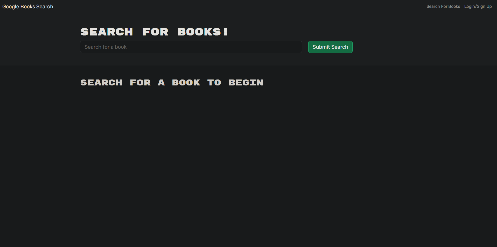
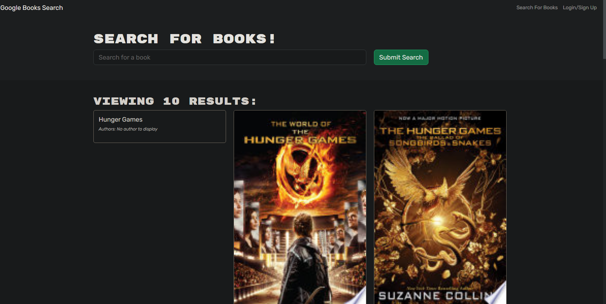

# Book-Search-Engine

## Description

This application was refactored from using strictly routing and express, to now implementing GraphQL typeDefs, resolvers, and an Apollo server.  The backend mixes Mongoose and GraphQL queries and mutations to run queries and muatations from the UI to the database.

## URL

Deployed App: https://book-search-engine-production-f9d3.up.railway.app/

## Screenshots

